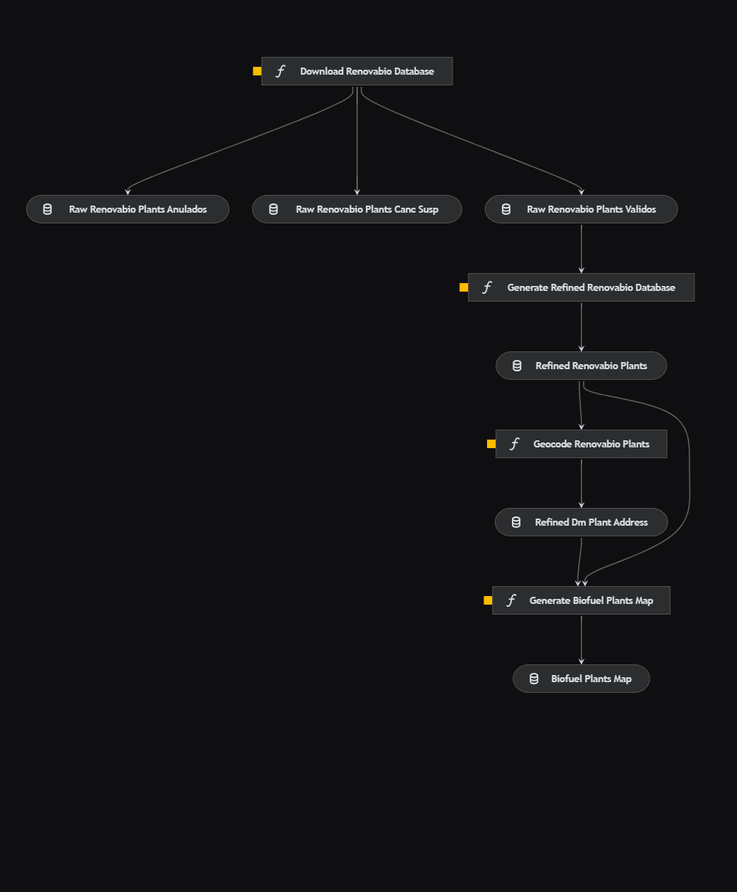

# Brazilian biofuel plants


[](https://github.com/daniel64bit/biofuel_brazil_plants/blob/main/LICENSE.md)

Para acessar a versão em português, [clique aqui](README-PTBR.md).

## Overview

This project aims to extract, refine, and geocode data about Brazilian biofuel plants obtained through `Certificates of Efficient Biofuel Production` issued by accredited inspection firms under [RenovaBio](https://www.gov.br/mme/pt-br/assuntos/secretarias/petroleo-gas-natural-e-biocombustiveis/renovabio-1/renovabio-ingles), approved by the [National Agency for Petroleum, Natural Gas and Biofuels (ANP)](https://www.gov.br/anp/en).

The data generated after all processing can be used in geospatial analysis, with a certain margin of error in relation to the plants' locations.

The data pipeline was built using [kedro 0.18.12](https://kedro.readthedocs.io/en/stable/).

## Key Features

1. Extraction of raw data from efficient biofuel production certificates issued by ANP.
2. Refinement of raw data, including data type standardization and arrangement.
3. Geocoding of refined data using [Selenium](https://selenium-python.readthedocs.io/index.html) and [Bing Maps](https://www.bing.com/maps/).
    - Geocoding with [Google Maps](https://www.google.com/maps/) in progress.
4. Map visualization of the geocoded data using [Folium](https://python-visualization.github.io/folium/).

## Data Pipeline



## Requirements

The required libraries for project execution are listed in the `src/requirements.txt` file. To install them, use the following command:

```
pip install -r src/requirements.txt
```

Additionally, you need to have the latest version of [geckodriver](https://github.com/mozilla/geckodriver/releases/) in a known directory.

## How to Run the Pipeline

To execute the project, use the command:

```
kedro run
```

To execute a specific pipeline, use the command:

```
kedro run --pipeline <pipeline-name>
```

## Contact

LinkedIn: [Daniel Rodrigues](https://www.linkedin.com/in/danielrod147/)
